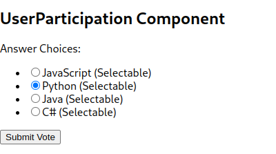

Farhan 

023-19-0101

BSCS 8 Section:B

<h1>TASK 01

<h1>Poll Display Component Code

importUserParticipationfrom'./UserParticipation';

import { useState } from'react';

importAnotherUserParticipationfrom'./AnotherUserParticipation';

functionPollDisplay({}) {

constquestion = "What is your favorite programming language?";

constchoicesArray = [

    { "id":1, "label":"JavaScript", "votes":0 },

    { "id":2, "label":"Python", "votes":0 },

    { "id":3, "label":"Java", "votes":0 },

    { "id":4, "label":"C#", "votes":0 }

  ];

const [selectedChoice, setSelectedChoice] = useState(null);

consthandleChoiceSelect = (choiceId) => {

setSelectedChoice(choiceId);

  };

return (

<h2>{question}</h2>

<ul>

{choicesArray.map((choice) => (

<likey={choice.id}>

{choice.label}: {choice.votes} Votes

</li>

    ))}

</ul>

<UserParticipationchoicesArray={choicesArray}/>

<AnotherUserParticipationchoicesArray={choicesArray}setSelectedChoice/>

  );

}

exportdefaultPollDisplay;

<h1>User Participation Component Code

constUserParticipation = ({ choicesArray }) => {

const [selectedChoice, setSelectedChoice] = useState(null);

const [hasVoted, setHasVoted] = useState(false);

consthandleChoiceSelect = (choiceId) => {

setSelectedChoice(choiceId);

  };

consthandleVoteSubmit = () => {

if (selectedChoice !== null) {

setHasVoted(true);

    }

  };

return (

<h2>UserParticipation Component</h2>

Answer Choices:

<ul>

{choicesArray.map((choice) => (

<likey={choice.id}>

<label>

<input

type="radio"

name="choice"

value={choice.id}

checked={selectedChoice === choice.id}

onChange={() =>handleChoiceSelect(choice.id)}

/>

{choice.label} (Selectable)

</label>

</li>

    ))}

</ul>

<buttononClick={handleVoteSubmit}>Submit Vote`</button>`

{hasVoted && `<ThankYouComponent/>`}

  );

};

constThankYouComponent = () => {

return (

<h2>Thank You for Voting!</h2>

  );

};

exportdefaultUserParticipation;

<h1>Another User Participation Component

importReact, { useState } from'react';

constAnotherUserParticipation = ({ choicesArray, onResetSelectedChoice }) => {

const [selectedChoice, setSelectedChoice] = useState(null);

consthandleChoiceSelect = (choiceId) => {

setSelectedChoice(choiceId);

  };

consthandleVoteSubmit = () => {

if (selectedChoice !== null) {

console.log('Selected choice:', selectedChoice);

    }

  };

consthandleAnotherUserClick = () => {

setSelectedChoice(null);

onResetSelectedChoice();

  };

return (

<h2>AnotherUserParticipation Component</h2>

Answer Choices:

<ul>

{choicesArray.map((choice) => (

<likey={choice.id}>

<label>

<input

type="radio"

name="choice"

value={choice.id}

checked={selectedChoice === choice.id}

onChange={() =>handleChoiceSelect(choice.id)}

/>

{choice.label} (Selectable)

</label>

</li>

    ))}

</ul>

<buttononClick={handleVoteSubmit}>Submit Vote`</button>`

<buttononClick={handleAnotherUserClick}>Another User`</button>`

  );

};

exportdefaultAnotherUserParticipation;

<h1>Thankyou Component 

importReactfrom'react'

importAnotherUserParticipationfrom'./AnotherUserParticipation'

importUserParticipationfrom'./UserParticipation'

constmsg="Thank you for your vote"

functionThankyouMessage() {

return (

<UserParticipationmsg/>

<AnotherUserParticipationmsg/>

  )

}

exportdefaultThankyouMessage

<h1> TASK 2

<h1> Timer Component Code

importReact, { useState, useEffect } from'react';

constTimer = () => {

const [countdown, setCountdown] = useState(10);

useEffect(() => {

consttimer = setInterval(() => {

setCountdown((prevCountdown) =>prevCountdown - 1);

    }, 1000);

if (countdown === 0) {

clearInterval(timer);

    }

return () =>clearInterval(timer);

  }, [countdown]);

return (

{countdown === 0 ? (

<h2>Time's Up!</h2>

    ) : (

<h2>Countdown: {countdown}</h2>

    )}

div>

  );

};

exportdefaultTimer;

on TIME UP:

